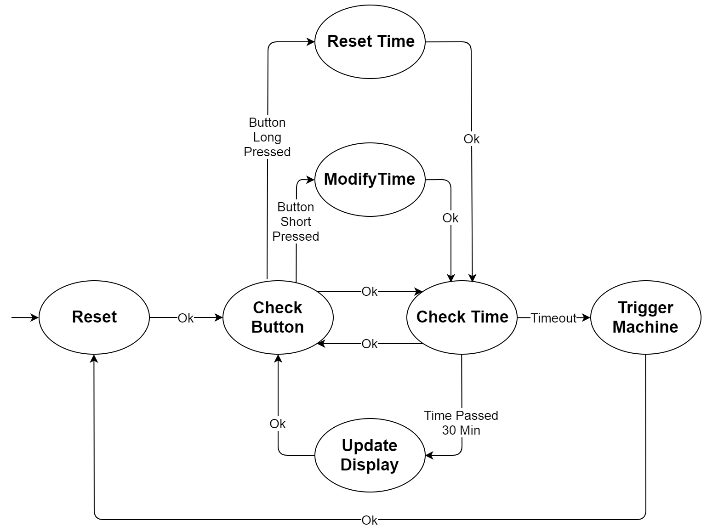
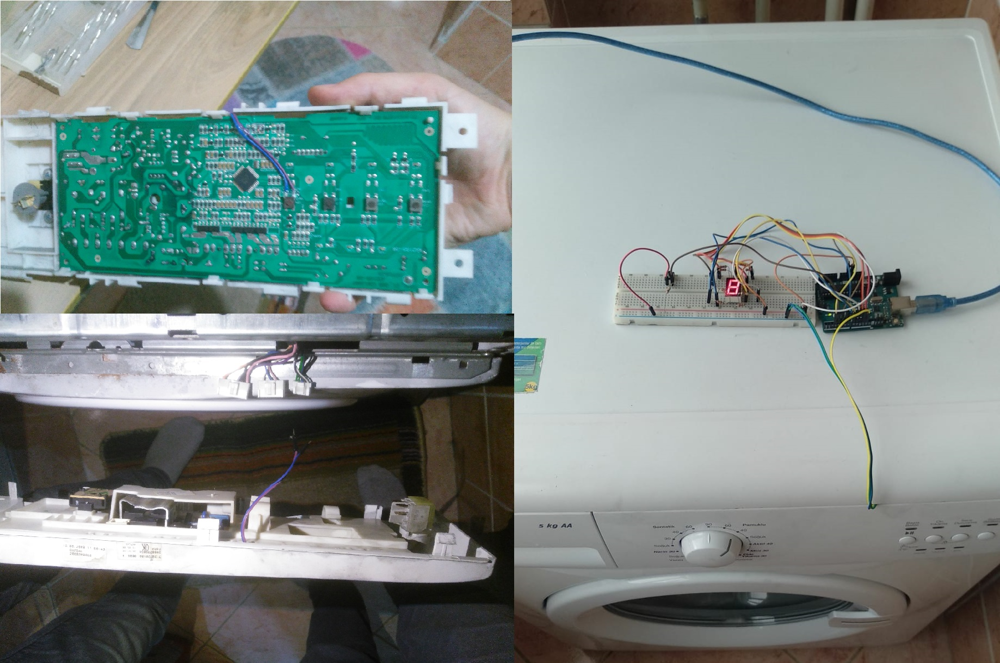

# Arduino Based Washing Machine Timer

[TOC]

## Read Before Continuing!

Washing machine, dishwasher and other machines operates at **high voltage**. Take precautions and always be careful. Wrong decisions may result in **DEATH !** Main board of the machines include high voltage even on a simple button. 

## 1. Introduction

There was two main problems:

- Odor comes from wet clothes stayed inside the machine for a long time (6 hours?)
- Noise of the machine

To overcome this problem, I simply set up a timer for the machine. 

### 1.1. How To Use

- Short press will increase waiting time by one hour.
- Long press will reset everything.
- 7 segment display will show remaining time. Uses hexadecimal notation.

- When timeout, machine will be triggered by relay. (Same thing as pressing start button for 1 second)
- Designed finite state machine is located below:

### 1.2. Requirements

- PC

- A washing machine or a dishwasher which doesn't have timer function
- Arduino UNO and USB cable
- 5V Relay (for controlling 110V / 220V)
- 7 Segment display
- Button
- Wire, soldering iron, insulating tape, zip tie, hot silicone glue, insulating glove, voltage tester pen etc.
- **A lot of caution** (for staying alive)

## 2. Installation

**Take insulation precautions before starting !**

### 2.1. Arduino

- Install required libraries:
  - https://github.com/dgduncan/SevenSegment
  - https://github.com/jonblack/arduino-fsm
  - https://github.com/SofaPirate/Chrono
  - https://github.com/slavaza/SuperButton

- Connect Arduino, relay and 7 segment display together. Pin configuration located at `CONSTANTS` section in source code. Relay must be connected `normally open`.
- Test configuration with uncommenting `//#define DEBUG` line in source code.

### 2.2. Hacking Start Button

- Cut off electrics.
- Take of the main board of the machine.
- Locate start button and solder wires to it.
- Put back the main board to the machine.
- Connect wires to relay.

### 2.3. Covering The Relay For Safety

- Fully cover the relay with hot silicone glue. Do not left empty area. 
- After silicone glue gone solid, cover it with insulating tape.
- Bind fully covered relay to a corner inside the machine using zip tie. **It must not fall off.**

### 2.4. Testing Leaks

- Turn on the electricity.

- Test every touchable/untouchable area with voltage tester pen. 
- Test arduino pins related to relay. Also test relay pins.

### 2.5 Testing The System

- If you left DEBUG line uncommented, you can test now. Press few times and wait.
- When timeout, relay will close circuit for 1 second.

## 3. Photos

